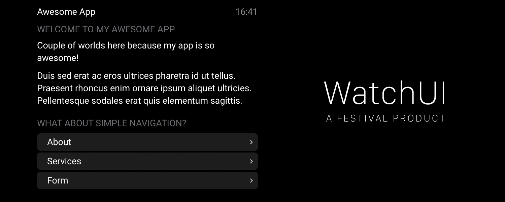
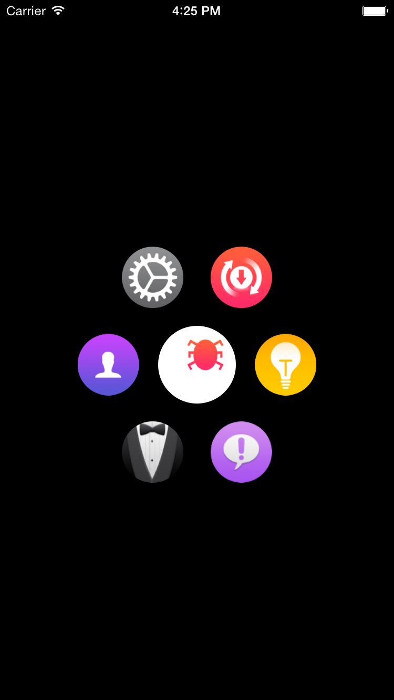
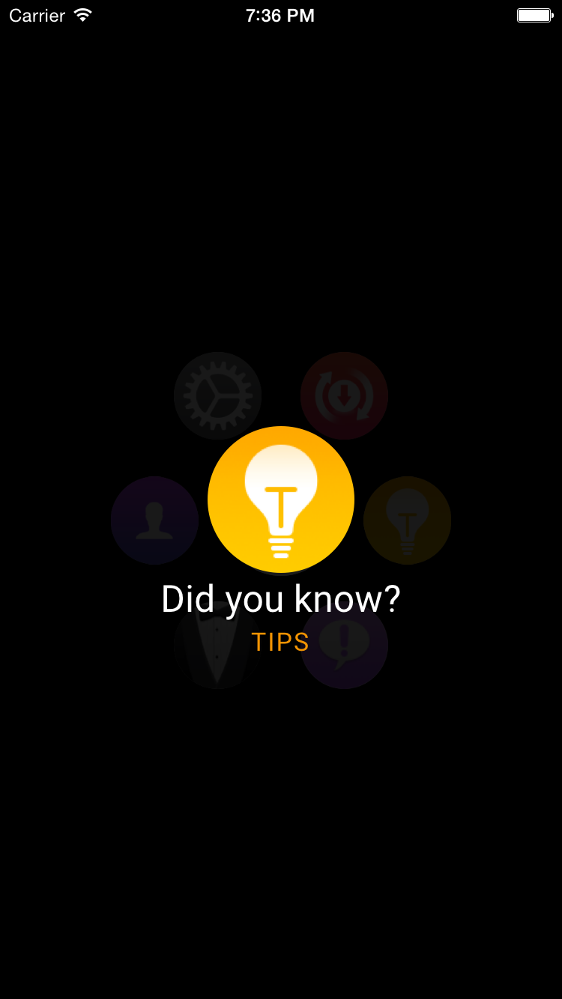
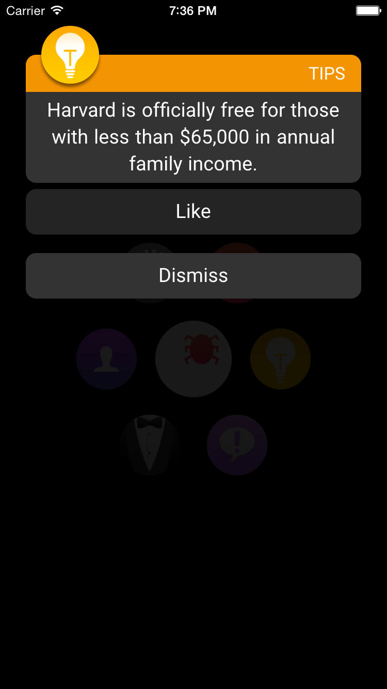

# WatchUI for Framework7
Apple Watch UI (including optional Home Screen) for Framework7



## Introduction
Framework7 is the best HTML Application Framework for iOS 7-styled apps I can imagine. Fast, versatile, modular. But something was missing.

Apple introduced the  ᴡᴀᴛᴄʜ at the September Special Event, alongside the iPhone 6 and iPhone 6 Plus. It seems to run something like iOS, but with a stripped down UI, easy to read on small screens. I though this would be the perfect addition to Framework7, so I recently started working on WatchUI.

WatchUI is something game developers would call "total conversion", something like what FakeFactory's Cinematic Mod is to Half-Life 2. It changes almost every aspect, but it still keeps that original feeling. That's why my recreation of Bug Reporter⁸, Bug Watch, will be based on WatchUI.

## What is included

* Watch Home Screen (more on that in the docs)
* Lists
* Modals (including Alerts and Notifications)
* Status Bar clock
* Colored Status Bar titles
* New page transitions

## How does it work
Framework7 is initialized by creating a global variable:

`var myApp = new Framework7([params])`

WatchUI is initalized by injecting into this variable, which then sets up WatchCore and WatchCoreUI:

`myApp.watch = new WatchApp([watch_params])`

WatchApp accepts several parameters which enable or disable modules, like the WatchUI Home Screen:

| Variable | Default value | Purpose |
|--------------------|------------------------|--------------------------------------------------------------|
| CoreAppListSource |  "apps/apps.json" | Specifies the origin for the remotely loaded apps. |
| CoreHideNavbar | true | Hides or shows Navigation Bar on WatchUI Homescreen (beta). |
| CoreHomeView | $('div.view#home') | Specifies the parent DOM element that contains the WatchUI Home Screen. |
| CoreIndexIdentifier | "index" | Gets the data-page attribute for the inital Framework7 page. |
| CoreInitHomeScreen | true | Enables/disables the WatchUI Home Screen. |
| CoreLoadAppsRemote | false | Enables or disables remote app loading for WatchUI. |
| CoreNavbarClock | true | Enables/disables clock in the upper right corner. |
| CoreNavbarClockElement | $('p.time') | Specifies the Element the clock should be applied on. |
| screenContainer | $("#screen-container") | Sets the Screen container element. |
| UIIconSize | 60 | If you use bigger or smaller icons than normal, you must change this value. |
| UIBubbleSize | 80 | Specifies the size of the icon zoom area of the Home Screen. Which is apparently a bubbble. |
| UIScrollRangeX | 35 | How far the user can scroll in X direction. Default icon size: 35px per circle while having more than one icon. |
| UIScrollRangeY | 55 | How far the user can scroll in Y direction. Default icon size: 55px per circle while having more than one icon. |
| UIEnableAppLabels | false | Enables/disables optional App labels |

### Required libraries
WatchUI requires some libraries to work correctly. These libraries include:

* jQuery
* Easing for jQuery
* fastclick.js
* Veloctiy.js
* Hammer.js

Each of these libraries is included in `js/lib/`

### Including WatchUI in your app
Let's assume you already have included Framework7. First, include the required CSS files.

```html
<link rel="stylesheet" type="text/css" href="css/WatchUI.css">
<link rel="stylesheet" type="text/css" href="css/WatchUI-home.css">
```

_If you are not going to use the WatchUI Home Screen, you can ignore_ `WatchUI-home.css`

After you have included the stylesheets, you can continue to include the JavaScript files. You might want to include WatchUI at the end of the page. After you did that, you can initalize WatchUI alongside Framework7.

```html
[...]
<script type="text/javascript" src="js/lib/jquery.js"></script>
<script type="text/javascript" src="js/lib/jquery.easing.1.3.js"></script>
<script type="text/javascript" src="js/lib/fastclick.js"></script>
<script type="text/javascript" src="js/lib/velocity.min.js"></script>
<script type="text/javascript" src="js/lib/hammer.min.js"></script>

<script type="text/javascript" src="js/WatchUI-1.0.1.js"></script>
<script>
	var myApp = new Framework7();
	
	myApp.watch = new WatchApp({
		/* Optional parameters */
	});
<script>
```

WatchCore and WatchCoreUI can be accessed always through `myApp.watch.core` and `myApp.watch.ui`.

## WatchUI Home Screen
Notes:

* `CoreInitHomeScreen` needs to be `true`
* Navigation Bars should be hidden on Home Screen (`CoreHideNavbars`)

The Home Screen uses a special DOM layout. The Screen container is located right after the opening `<body>` tag. This is an example that is used in Bug Watch:

```html
<div id="screen-container">
	<div class="view" id="home">
		<div class="appicon bugs" id="apps/de.sniperger.bugs/index.html">
			
			<p class="label">Bugs</p>
		</div>
		<div class="appicon settings" id="apps/de.sniperger.preferences/index.html">
			
			<p class="label">Settings</p>
		</div>
		<div class="appicon update" id="apps/de.sniperger.update/index.html">
			
			<p class="label">Update</p>
		</div>
		<div class="appicon usercp" id="apps/de.sniperger.usercp/index.html">
			
			<p class="label">User CP</p>
		</div>
		<div class="appicon tips" id="apps/de.sniperger.tips/index.html">
			
			<p class="label">Tips</p>
		</div>
		<div class="appicon setup" id="apps/de.sniperger.setup/index.html">
			
			<p class="label">Setup</p>
		</div>
		<div class="appicon feedback" id="apps/de.sniperger.feedback/index.html">
			
			<p class="label">Feedback</p>
		</div>
	</div>
</div>```

This is what it will look like (sans the optional labels):



_Note: These app icons are not included in WatchUI. This is a beta screenshot from Bug Watch_

As you can see, the apps are rendered around the first app in circles from the center, then from top left to bottom right.

You might need some time to get familiar with how App Icons are ordered. Just play around with it until you're happy.

### App API
If you are using Remote Apps, you can easily create your own apps using JSON. This is what the apps.json file is for. The basic syntax is very easy:

```json
{
	"apps": [
		[YOUR APPS HERE]
	]
}
```
Apps are added to the `apps` array, which is, if enabled, loaded into WatchUI and generates the Home Screen. If you want to create your own app, just set the following keys to your desire:

```json
{
	"title": "Your App",
	"identifier": "yourapp",
	"bundleID": "com.yourcompany.yourapp",
	"executable": "index.html",
	"icon": "img/icons/bugs.png"
}
```

There are more keys that might get useful in the future:
```json
	"preinstalled": true,
	"notifications": false,
	"color": "#ff730f"
```

The following method returns an app's info as a JavaScript object, which can be used in notifications:

```javascript
myApp.watch.core.apps.getAppInfo(appID);
```
Just replace `appID` with the application ID you require information from.

## Notifications
Framework7 has a great modal system. But for WatchUI, it's not good enough.

 ᴡᴀᴛᴄʜ Notifications consist of two "scenes", 

* the "Short Look" interface, which displays the app icon, the app title and a brief description of what happened, and
* the "Long Look" interface, which is the notification itself and contains the message and action buttons.




<sub><sup>__Left:__ Short Look interface, __Right:__ Long Look interface with custom "Like" button</sup></sub>

Because of that extended content, WatchUI needed a custom Notification method. Here is the example that is used in the screenshots above:

```javascript
app.watch.core.notify({
	title: "Did you know?",
	subtitle: app.watch.core.apps.getAppInfo("tips").title,
	message: "Harvard is officially free for those with less than $65,000 in annual family income.",
	icon: "img/icons/AppIcon-Tips.png",
	color: app.watch.core.apps.getAppInfo("tips").color,
	buttons: [
		{
			title: "Like",
		}
	]
});
```

You might have noticed that only one of the two buttons is specified in this example. This is because the  ᴡᴀᴛᴄʜ OS automatically adds the "Dismiss" button. The same happens in WatchUI. You'll only need to specify the buttons that contain actions.

Buttons only have `title` and `onClick` attributes. The `onClick` attribute can contain a function that gets called when the button is pressed and the notification is gone (so there's not too much action at once).

## Debugging
If you want to display the versions of Framework7, WatchApp, WatchCore or WatchCoreUI anywhere, you can access these attributes from your Framework7 object:

```javascript
myApp.version /* Framework7 Version */
myApp.watch.version /* WatchApp Version */
myApp.watch.core.version /* WatchCore Version */
myApp.watch.ui.version /* WatchCoreUI Versionn */
```

<sub><sup>WatchUI Code is based on [Pipes Apple Watch Demo](http://demoapplewatch.com)</sup></sub>